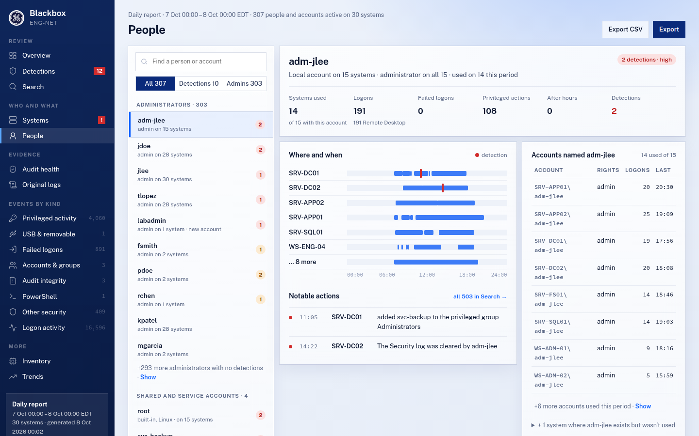

# Reports

## Collection and report periods

Blackbox **collects** every 15 minutes (by default) and **reports** on the schedule you
choose:

- **Collecting:** each run copies only the security-relevant events out of
  the logs and remembers where it stopped, so the copy stays small.
  Collecting often keeps ahead of a busy log, but Blackbox cannot stop a
  full log from overwriting events: it detects and reports any loss
  (Audit health's **Log sizes** tab lists each log that overwrote events).
- **Watching between reports (AU-5).** Auditing stopped, a log cleared or
  events lost are seen at the next collection and shown by `blackbox
  status` (which exits 4 when something needs attention) and in the next
  report. Blackbox sends no alert of its own beyond the status icon on
  Windows, so for AU-5 run `blackbox status` from your monitoring (for
  example a scheduled task or a monitoring agent's check) and alert on
  exit code 4.
- **Reporting:**
  - The first report is produced at install time. Installing again (to
    upgrade or change settings) does not produce one, so the schedule is
    kept.
  - After that, each report ends at the time set by `report_at` (default
    `Wednesday 00:00`: a weekly report covers the week up to Tuesday night,
    ready for Wednesday morning). Daily reports end at that time each day,
    monthly ones on the 1st.
  - Each report starts where the previous one ended, so every event
    appears in exactly one report.
  - Events that happened earlier but were collected late, for example
    because the system was off, go into the next report marked **Late**.

**Report folders** are named for the end of the period and the site name
set in setup, for example `2026-10-05_0000_Lab-3-LAN`. Without a site
name, a report on one computer is named after it, and a collector's
report after the collector. A manual report's folder ends in `_manual`
(`_interim` before 0.15), and a report for a chosen period in `_range`.

To produce a report now, run `blackbox report`. This is a **manual**
report: it covers the time since the last scheduled report, is marked
*Manual* in the report and on the list of reports, and does not change the
schedule. The next scheduled report still covers its whole period. A
manual report shows everything collected so far, even an event stamped
a little after the moment it was made (as happens just after the clock
is corrected). Manual reports do not include the original logs; those
go with the scheduled report. A manual report's **Original logs** page
says where they wait (`archive_dir`), the period and size so far, from
how many systems, and when the scheduled report that holds them is due.

**A report for any period.** `blackbox report` run by hand asks which
period to cover: press Enter for the time since the last report, type a
number of days (`30`), a start date (`2026-09-01`), or a start and end date
(`2026-09-01 2026-09-15`). The same as options:

```
blackbox report --days 30
blackbox report --from 2026-09-01
blackbox report --from 2026-09-01 --to 2026-09-15
```

The events come from Blackbox's own copy, which reaches back to the oldest
events in each log when it was installed and is kept for
`retention_days` (for good by default). For any time before that copy
starts, Blackbox reads this computer's event logs (or Linux logs) as far
back as they still go. The report says what it covers and where the
earliest available event is. It is saved with `_range` in its folder name,
listed as Manual, and does not change the schedule. On a collector it
covers every system's collected events; only the collector's own logs can
be read further back.

With exported log files (`--xml`, `--evtx`, `--audit`, `--syslog`), the
same options keep only the events in that period:
`blackbox report --audit audit.log --from 2026-09-01 --to 2026-09-15`.

If you change `report_at`, the next report ends at the new time and
covers the time since the last report (so it may be shorter or longer
than usual once).

## Severities

| Severity | Meaning | Examples |
|---|---|---|
| **High** | Review now | Log cleared, auditing stopped, user added to an admin group, audit tampering command, malware detected, USB device never seen before, USB network adapter |
| **Medium** | Review | Account created or deleted, password reset, USB storage connected, file written to USB, service installed, time changed, refused sudo command |
| **Low** | Routine but relevant | Single failed logon, sudo command, admin logon |
| **Info** | Context | Logons, logoffs, startup and shutdown |

Only High and Medium are flagged in the report: the event tables show
the severity for those and a dash for the rest. Every event is still
listed, whatever its severity.

The report uses two words for what needs a person: **Detections**, to
investigate, and **Health**, to fix. Every High event is in a detection:
one that no detection rule below took is a detection of its own, one per
kind of event on each system ("Log cleared on WS-07", with every such
event listed in it). `summary.json`'s `high` counts High detections.

## Detections

Detections are patterns across several events: steps that are ordinary on
their own but worth a look together, and things done for the first time.
They are worked out from events Blackbox already collects, so they add
nothing to what computers collect, store or send. They are also listed in
each report's `summary.json`.

| Detection | Severity | When |
|---|---|---|
| Possible password guessing | High | 5 or more failed logons for one account on one computer within 15 minutes |
| One source tried several accounts | High | Failures for 3 or more accounts from one address within 15 minutes |
| Same account failing on several computers | High | Failed logons for one account on 3 or more computers within 30 minutes (a collector sees every computer) |
| Possible covering of tracks | High | An account created, someone added to a privileged group, or sudo rules changed, then within 24 hours on the same computer a log cleared or altered, auditing stopped, an audit rule added, removed or refused, auditing on an object changed, anti-malware turned off or an exclusion added, the firewall stopped, or Blackbox stopped, removed or its exclusions or retention changed, by a person. Blackbox's own installer (`Blackbox-Setup-<version>.exe`) writing its data folder is not a step when Blackbox recorded that install or upgrade on the same computer, nor is the Event Log service writing the original-log pieces during a Blackbox run; those writes are not rows either |
| Account created and deleted within a day | High | The same account created and deleted on one computer within 24 hours |
| Auditing was switched off | High | The audit service stopped by a person, with how long it stayed off |
| Successful logon after failures | Medium | 3 or more failures, then a success, within 30 minutes |
| New USB device, then administrator activity | Medium | Administrator rights used within 30 minutes of a USB device never seen before |
| The clock was moved back (or forward) by a person | High back, Medium forward | A person (not the Windows Time service) set the clock by more than 5 minutes (Windows event 4616). Changes of under a second, which each `Set-Date` also logs, are not rows |
| Administrator activity outside working hours | Medium | Needs `working_hours` in the [settings](configuration.md); one detection per person, computer and day |
| First logon to this computer | Medium | A person logs on (at the computer, by Remote Desktop or SSH) to a computer they have not logged on to before |
| First use of administrator rights | Medium | A person uses administrator rights on a computer for the first time |
| First logon from this address | Medium | A logon to a computer from a network address not seen before |

**Across reports.** Each report also looks at the day before its period,
so a pattern that starts at the end of one report and finishes in the
next is still detected. It is reported once, in the report where it
finishes.

**First times.** Blackbox remembers who has logged on to each computer,
who has used administrator rights on it, and the addresses logons came
from. A computer's first report only learns this, and says so, so that
installing Blackbox does not flag everyone. Something not seen for a year
counts as new again. Service and computer accounts, and SYSTEM, are left
out.

**One row per action.** Windows and Linux often record one action more
than once (a failed logon as 4625 and 4776; a service install as 7045 and
4697; a USB stick in up to four logs). These are merged into one row, the
most informative, and a service is shown with both of its names. Two
records of the *same* kind are two actions: five failed logons in one
second are five rows, so fast password guessing is detected. Removing a
deleted account from its primary group ("None" or "Domain Users") is not
shown as a separate change.

**Repeats are one row.** The console host Windows starts for every
console program run with administrator rights
(`C:\Windows\System32\conhost.exe 0xffffffff -ForceV1`) is not a row of
its own: the program that started it says "Also started: N console
windows" in its details. One started by sshd (for each command in an SSH
session) is counted with that person's logon on that computer, or left
out. Only that program, by its full path, with only those arguments, is
folded: a `conhost.exe` anywhere else, one with other arguments or no
command line recorded, or one started by any other program that is not a
row, stays a row. Windows records each SSH sign-in as two logons (4624)
at the same second, not always linked to each other: they are one row,
with the second logon ID in its details ("Also logon ID"), so Logon
activity counts sign-ins; two logons from different addresses are two
rows. One log clear is one row too: the command that cleared it
(`wevtutil cl`, `Clear-EventLog`) is folded into the log's own record of
the clear when they match (same computer and person, the command names
that log, within a minute), its command line under "Cleared with". One
audit policy change is one row: the `auditpol /set`, `/clear` or
`/remove` command is folded into the change it made (4719, or 4912) when
the account matches and they are within a few seconds of each other, its
command line under "Changed with"; switching auditing off and on again is
two rows. Identical records (the same system, person, action, address
and text within a minute) are one row marked **×N**, with the time of
each in its details ("Recorded: 7 times: …"). Failed logons and log
clears are never folded: each is an attempt, and each clear is one
action, so two clears a minute apart are two rows and the detection says
"2 logs cleared". Every count in the report (the sidebar, the Overview's
numbers, People, Trends) counts rows.

**A refused delete is an attempt, not a removal.** A command that deletes
Blackbox's files whose delete the operating system refused (Linux:
`success=no` with a non-zero exit; Windows: a 4656/4663 audit failure by
the same process) is "tried to delete Blackbox's files (refused)", Medium,
listed under Medium as "refused attempts to delete Blackbox's files". It
is not in the "Blackbox's files removed" detection, its count, or
"Possible covering of tracks"; the deletes that happened keep their High
detection with their own count (DET1).

**A delete is High only when a record shows it worked** (DET1b): a file
of Blackbox's deleted or changed by the same process (Linux: a
`nametype=DELETE` with `success=yes`; Windows: a 4663 delete), or a file
the command names gone at the Blackbox run that collected it. When the
audit log has only the command line (a share mounted over CIFS, or no
watch rules on Blackbox's folders), the row is "ran rm on Blackbox's
files: …" (or `del`, `Remove-Item`), Medium, with "Whether it worked:
isn't recorded" in its details, listed under Medium as "delete commands
on Blackbox's files (whether they worked isn't recorded)". Like a
refused delete, it is not counted as a removal. A file still there at
that run is named under "Still there at Blackbox's next run". A file gone
from a folder Blackbox moves files out of itself (the inbox, the outbox,
the original logs waiting) does not count as deleted: it is named under
"Not there at Blackbox's next run". A pattern (`*.json`) that matches
nothing is not known either way.

**Blackbox's own writes.** The Event Log service writing the original-log
pieces during a Blackbox run is not a row, also in a manual report made
right after a run that made a scheduled report: the report looks at
Blackbox's runs from an hour before its earliest event.

**Audit integrity kinds.** Each row has its kind: Log cleared, Audit
policy changed, Logging stopped (the event log or audit service stopping,
a full log, dropped records), Blackbox (its install, upgrade, settings and
files), Firewall, Clock, Startup and shutdown, or Other; the page's
**Kind** field counts show how many of each.

**Linux sign-ins and restarts.** One SSH sign-in or sign-out is one row,
even when it is recorded twice (two audit login records, or the same
line read from two logs). The audit service stopping during a planned
restart or shutdown (`reboot`, `shutdown`, `systemctl poweroff`, or a
shutdown record within minutes) is shown as routine, not as auditing
being switched off. When `systemctl stop auditd` (or `service auditd
stop`, `pkill auditd`) was run just before, the stop is shown as done by
the person who ran it: systemd sends the signal, so auditd's own record
names no one.

**Refused audit changes (Linux).** With the rules locked (`-e 2`, as the
STIG requires) the kernel refuses `auditctl -e 0`, `-D` and rule changes,
and records the refusal. Those rows say "tried to turn off auditing;
refused because the audit rules are locked … Auditing stayed on" (High
for turning auditing off, Medium for rule changes). They are never shown
as auditing being off.

**SSH failed logons (Linux).** OpenSSH 9.8 and later split the server
into `sshd`, `sshd-session` and `sshd-auth`; they are all treated as
`sshd`, so one attempt is one row. For a name that doesn't exist, sshd
records only "(invalid user)": the name tried is taken from the password
check of the same attempt, and every try says "the user name does not
exist", not "wrong password". Attempts from the computer itself (`::1`,
`127.0.0.1`) are shown as from `localhost`, so several accounts tried
from it is still detected.

**Login scripts (Linux).** At each SSH sign-in, `pam_motd` runs the login
message scripts in `/etc/update-motd.d` as root, and a root login shell
(`sudo -i`, `su -`) runs `/etc/profile.d` and the `.bashrc` scripts.
Each is one Info row ("The login message scripts ran as root when jsmith
logged on"), not a "ran as root" row per command. Only commands run as
root in that session before it starts (login message), or the usual
profile commands (`locale-check`, `id`, `dircolors` and so on) in the
first 3 seconds of a root shell, are folded in; anything else the person
runs is listed as usual. A change to the scripts themselves is a file
change, reported when the audit rules watch those folders.

**Mounts (Linux).** A disk mounted from the command line (`/dev/…`,
`UUID=`, `LABEL=`) is removable media (Medium). Memory and system
filesystems (`tmpfs`, `proc`, `overlay` …), bind and move mounts and
remounts are not; network shares (`nfs`, `cifs`, `sshfs`) are Low,
"mounted a network share".

**Auditing off at collection (Linux).** Each collection checks that the
audit service is running (`systemctl is-active auditd`) and that kernel
auditing is on (`auditctl -s`). If not, the computer is red: "Auditing
off" on Systems, a note on Logs intact in the system's settings on Audit health, a line in
`blackbox status` (also in a collector's list of systems) and a red
status icon with a notification.

**Computer accounts.** An account whose name ends in `$` is treated as a
computer account, and its routine activity is left out, only when it is
this computer's own account or comes from a domain. A local account named
like one (for example `helper$`) is always shown.

**Windows' own housekeeping.** The firewall rules Windows registers for
its built-in apps and services (app packages such as `@{Microsoft.…}`,
WinDefend's rules), changed by the Windows Firewall service (by name or by
its SID) or SYSTEM, are one Info row per computer and day with the counts;
rules changed by people keep their own rows. A firewall rule with no name
is shown by its rule ID. Defender's own bookkeeping in its settings
(signature and scan state, 5007 events) is one Info row per computer and
day; changes to exclusions, real-time protection, any `Disable…` switch,
tamper protection and Defender policy keep their own rows.
`DisableBmNetworkSensor` turned on outside Policies is Low, with a note.
Windows setup's own activity (the `defaultuser0` account the out-of-box
setup uses, and events recorded under the setup PC name `MINWINPC`) is one
Info "Windows setup" row per computer and day, and is never paired with
other changes as covering tracks. Blackbox's own writes to its data folder
and the programs Blackbox starts (`wevtutil`, `auditpol` and so on) are
left out. Deleting a report is one High row per report, not one per file.
Logon rights given or taken away (4717/4718) are a Medium sentence when a
person did it, and left out when Windows grants them itself. A 5038 (a
system file whose signature doesn't match) on a Microsoft Defender
platform file is Medium "during a Microsoft Defender update" when
Defender's own log records an update (2000/2014) on that computer within
15 minutes, to that platform version (the folder the file is in); the
update is in its details. Otherwise it stays High, with a note: Windows
often logs this while Defender updates its platform, and the row says how
to tell. Defender's updates are not rows. PowerShell module code that
Windows generates (CDXML modules such as the firewall's
`Get-NetFirewallRule`, in every part of a long script) is not flagged.
OpenSSH for Windows' per-connection account `VIRTUAL USERS\sshd_<pid>` is
not a person. An account "renamed" to its own name and a new account
joining its default primary group (None) during Windows setup are left
out. Events recorded under a computer's name from before setup renamed
it are shown on that computer, with a "Recorded under its former name"
detail. On Linux, the temporary account files `groupadd` and the other
account tools write (`/etc/group+` and so on) and Blackbox's own writes
in its data folder are not rows of their own; the account change is.

**Hidden PowerShell.** PowerShell started with two or more of a hidden
window, a bypassed execution policy, no prompts (`-NonInteractive`) and an
encoded command is flagged Medium, whatever the script does: that is how
scripts are run unseen. A command that clears logs or changes auditing is
High however it is written, including with the program's path in quotes.

**Process starts.** Programs started with administrator rights are
listed. Programs a standard user starts are not, to keep reports
readable; their logons and anything they change still are. PowerShell
run with `-File` reads "ran the script C:\Scripts\backup.ps1", with the
full command line in the event's details. A logon with explicit
credentials (4648) names the program only when Windows recorded one
(UI21).

**Nothing dropped silently.** A Windows Security-log event Blackbox has
no translation for is listed on Other security as "Security event <ID>";
the very frequent ones are counted instead. Audit health lists them all
with their counts, and marks the audit subcategories whose events are
only counted. On Linux, a record of any keyed audit rule Blackbox has no
translation for (your site's own rules included) is an Info row naming
the rule. See the [Windows](windows.md#what-blackbox-reads) and
[Linux](linux.md#set-up-auditd) guides.

**When the clock is wrong.** Each report covers what was collected since
the previous one, in the order it was collected, so changing the clock
can't keep an event out of every report. A period never starts after it
ends. When the clock was moved back (a recorded collection time is now in
the future, or Windows logged the time being set back, event 4616),
the report has the High detection **The clock was moved back**,
`blackbox status` says so and exits with code 4, and on Windows the
collection task is registered again so its next run follows the corrected
clock. Events recorded while the clock was ahead are shown in the next
report, not held back until the clock catches up.

**Exclusions.** `exclude_users` and `exclude_processes` leave out routine
activity only. Failed logons against an excluded account, changes to it,
log clears and audit changes by it, and anything of Medium severity or
above are always shown. An entry with a domain (`CORP\svc_backup`)
matches that account only; one without matches the local account. The
Overview, and a note under Audit health's Settings to fix, say what was left out.

## Original logs

Reports show what Blackbox found in the logs. The original logs are kept
too, for an assessor or an investigation, because the report's own event
lists and `events.zip` hold only the security-relevant events, translated.

Each report's folder holds the original logs it was made from, unaltered:
one zip per computer, `logs-COMPUTER.zip`, holding that computer's daily
archives up to the report. Each computer archives once a day on its own
schedule, so a zip need not line up with the report's period (a sender's
day can start hours before it and end hours before its end): the Original
logs page says, for each computer, where its zip starts and that the rest
is in the next scheduled report's folder (AR10).

| Computer | What is in the zip | Open it with |
|---|---|---|
| Windows | `Security.evtx`, `System.evtx`, and the USB, Defender, device and PowerShell (`Microsoft-Windows-PowerShell-Operational.evtx`, every script block, not only the ones reported) logs, as `.evtx` files | Event Viewer (Open Saved Log), or `Get-WinEvent -Path`. Each `.evtx` has its message text next to it (`LocaleMetaData`, from `wevtutil al`), so its events read the same on a computer without the programs that wrote them |
| Linux | `audit.log`: the audit records, in their original format | `ausearch -if audit.log`, or `aureport -if audit.log` |
| Linux | `syslog`/`messages` and `auth.log`/`secure`: the lines for the period (or `journal.log` from the systemd journal when there are no log files) | Any text editor |

**The Original logs page** (UI-R1) has four cards: **Original logs in
this report** (zips against systems, e.g. 28 / 30, "2 systems sent nothing
(see Systems)", and any set aside), **Complete**, **With a gap** ("1 log
cleared · 3 PowerShell overwrites") and **Checked** (✓ when every zip
matches the SHA-256 recorded when it was made). Below, one table of every
system, grouped Servers / Workstations, gaps and missing first, with an
**All / Gaps and missing** switch: the system (click it for what is in its
zip, log by log, with each file's hash), a status (**Complete**, **Gap**,
**Missing**, **Set aside**, **Hash mismatch**), a short note ("PowerShell
log overwrote 415 events 12:40", "Security log cleared 14:22; nothing
lost", "nothing received since 6 Oct 04:00"; the whole of it on hover),
what is inside ("3 .evtx · 3 pieces"), the size and the file. Warnings that
logs could not be archived, were set aside (AR7), were never put in a report
(RET1), or that earlier reports are missing or changed are at the top. The
**Giving these to an assessor** box says, in three steps, how to check
them without Blackbox: `sha256sum -c manifest.sha256` (Linux) or `blackbox
verify <folder>`; open a `.evtx` in Event Viewer or read `audit.log` with
`ausearch -if`; each zip's `archive.json` lists every file with its hash,
and any gap with its reason. The report folder's `README.txt` starts with
the same three steps.

Inside, there is a folder for each day, named for the time it covers (in
UTC), with that day's logs and an `archive.json` listing each file's
SHA-256. The zip's own SHA-256 is in the report's `manifest.sha256`, so
`blackbox verify` checks it with the rest of the report.

**How it works.** At every collection, each computer exports what its
logs gained since the last export, while the logs still hold them: with
`wevtutil epl` on Windows, and by copying the new lines on Linux. Each
export starts where the last one ended **by position, not by time**
(AR8, AR9): on Windows after the last record ID exported, on Linux after
the last byte of each log file (finishing a file rotated since) and the
journal's cursor. So a record written in the same second as an export,
and anything stamped while the clock was set back, are in the next one.
The times in `piece.json` and `archive.json` are for reading only, and
all in UTC (ending in `Z`), the gaps and each log's coverage included,
in each piece as well as in the archive (TZ1, TZ1b); `blackbox status` shows times in local time only, and names the
zone once, on its first line (`Times: local time, EDT (UTC-04:00)`). A log
the collection read nothing new from is left out of that export. If the
log no longer holds the records after the last export (it overwrote
them), they are a gap named by number ("records 172279-172285"); on
Linux, audit serials that don't follow on ("audit serials 41323-41330
are not in the audit log") are a gap too. The first export after
installing or upgrading to 0.22 is still by time; it sets each log's
position. Once a
day the exports are packed into one archive: the `.evtx` files of each
export are kept as they are (named after the export's start time, to
the second, e.g. `Security_20261005-041503Z.evtx`, when there is more
than one; two exports started in the same second get `-2`, `-3` …), and the
text logs are joined in order into one file. The first export reaches
back a week. So a log that rolls over within the day (one Windows Update
run can fill a 20 MB Security log in an hour) loses only what it
overwrote between two collections.

`archive.json` records, for each log, the part of the period it actually
covers (`logs[].from`, the oldest record present) and the events
Blackbox knows it overwrote before they could be exported
(`logs[].overwritten`, from the collection's record numbers). The
Original logs page shows the same, e.g. "Covers from 5 Oct 04:08; 94,565
events were overwritten before they could be exported". If a full log
had already overwritten part of the period since the last export, that
part is recorded as missing: the page shows "Missing <from> – <to>:
overwritten before it was saved" for that log and marks the system **Gap**, `summary.json` lists it under the archive's `gaps` (and the
coverage under `logs`), and `blackbox status` says **LOGS INCOMPLETE**
for 14 days and exits with code 4. For another log, such as the
PowerShell log, the line is "Logs incomplete" and does not change the
exit code. Each log has one line, however many times it overwrote
itself: how many times since when, the latest part, and the same advice
as its "Events lost" line. The fix is a larger log (`blackbox check`
gives the size, from the same rate as `status`), or, on a system that
collects less often than every 15 minutes and whose log holds more than
that, collecting more often.

A log cleared since it last had a record exported is not an overwrite:
the clear is its own High row. Every clear seen since the last export is
a gap, whatever the log's size: Windows empties a cleared log's file, so
a log cleared at 1% of its size never looks full, and its record numbers
just start again. The gap runs from the last export to the clear and is
labelled with who cleared it and when, also when the log is still empty:
the Original logs page says "Cleared by claude at …: its events from
before then are not in this archive", `archive.json` has `cleared` on
that gap, and `blackbox status` has a "Log cleared:" line with no size
advice and no exit code 4. Until a record written after the clear has
been exported, the log is not taken for one that overwrote itself, and
`blackbox.log` does not say its records "were overwritten before they
could be collected".

**Exports lost or changed before packing.** Each export's files are
hashed when they are written (`piece.json`). When they are packed, a file
that has been deleted or can't be read is left out and the rest are still
packed: `archive.json` records it under `gaps` with its log, its period
and the reason (e.g. "Application.evtx, exported for … was missing when
the logs were packed"), and the Original logs page and
`blackbox status` (**LOGS INCOMPLETE**) say so. Its events are still in
the reports; only the original copy of that part is gone. A file whose
hash no longer matches is packed as it was found, marked `changed` in
`archive.json`, and the report has a High detection, "Saved original
log changed before it was archived". It says it was found by Blackbox's
own check when it bundled the logs for the report, not by an event: it
is listed under "Found when this report was made" (after the period),
and its panels name the system, the log and the file (UI21). On Linux, `blackbox check
--audit-rules` also watches `/var/lib/blackbox/archive-pieces/` for
writes by anything but Blackbox, a root script included.

If packing fails altogether (the archive folder can't be written, for
example), the exports are kept and packing is tried again at every run.
Until it works, `blackbox status` says **ORIGINAL LOGS NOT ARCHIVED
since <time>: <reason>** and exits with code 4, the status icon notifies
once, and reports say so at the top of Original logs and on the Overview.

**An archive that fails its check.** Every daily archive is checked
against the hashes in its `archive.json` before it goes into a
scheduled report. One that fails (damaged, or changed after it was
written) is left out of that report and the others still go in: it is
moved to a `set-aside` folder next to it (e.g.
`archives\WIN11\set-aside\WIN11_…zip`) and not tried again. For 14 days
`blackbox status` says **ORIGINAL LOGS NOT IN REPORT <report>: <the
computer>'s logs for <from> to <to>: <reason>** with where the file is,
and exits with code 4; the status icon notifies once. The report says so
on the Overview ("Original logs not in this report", never "Original
logs archived") and on Original logs (a warning at the top and a **Set aside** line in its table), and a manual
report made afterwards says so too. The events are in the report; the
original copy of that period is only in the file set aside. Archives
written before 0.21 could hold two `.evtx` files under one name (two
exports started in the same minute); they are still read, in order, and
rewritten with the second one renamed (`…-2.evtx`, contents and hashes
unchanged, noted in `archive.json`) when they are bundled.

**After the clock is moved back.** Exports follow on from the end of the
last one. If the clock was ahead and is then corrected, what is written
afterwards is stamped before that end. Blackbox notices, starts the next
export at the first record written since the last one, so nothing is
skipped, and notes it in `archive.json` and on the Original logs page.
Records stamped in the overlap may then be in two consecutive exports.

Until then, the exports and the archives (this computer's and, on a
collector, those senders delivered) wait in the `archives` folder in the
data folder, or in `archive_dir` if set (setup asks for it: choose a
larger volume for many computers). When a **scheduled** report is made,
the computer packs its exports so far, then all the archives waiting go
into the report's folder and are removed from there. A manual report
(`blackbox report`) leaves them waiting for the scheduled one. It works
the same on a standalone computer and on a collector.

A computer that sends to a collector delivers its daily archives with its
events. The collector checks every file against its hash when it arrives;
a damaged or altered zip is set aside in `inbox-set-aside` in the data folder. A
day's logs go into the report whose period its save ends in, so a
computer that was off catches up in the next report.

The **Original logs** page lists each computer's zip with its size and
SHA-256, checked against the hash recorded when the zip was made, and
shows what is inside each one. A computer with no logs for the period is
listed first, as Missing.
They are also listed in `summary.json`.

**Retention.** The zips live only in the report folders. Under
`retention_days`, a report folder is deleted with everything in it,
including its original logs, once its period ended more than that many
days ago. Its age is its period end (from the report ledger, or its
`summary.json`), not the folder's date, so a folder restored from a
backup is not removed for the date the copy gave it; a folder with no
readable period end is kept. Set `retention_days` from your site's
records schedule (the NARA General Records Schedule or your DoD
component's records schedule; ask your ISSM), not from AU-11, which
leaves the period to the organization; leave it at 0 while a legal hold
covers these records, or copy the report folders elsewhere first.

Original logs that are in no report yet (archives waiting in
`archive_dir` or the data folder, those set aside, and those senders
delivered to a collector) are never deleted under `retention_days`:
they may be the only copy. Once one is older than `retention_days`,
`blackbox status` says **ORIGINAL LOGS NEVER REPORTED: <computer>:
original logs from <from> to <to> have waited <N> days and were never
put in a report** and exits with code 4, and the report says so in a
warning at the top of Original logs.

Expect a few MB a day per Windows computer (much less for Linux),
compressed. It depends on how busy the Security log is.

**Deleting a report folder.** What is lost depends on the folder:

- **A scheduled report** holds the only copy of its period's original
  logs (they were moved out of `archive_dir` into it), its hashes
  (`manifest.sha256`), and its day-by-day counts for Trends
  (`summary.json`). The collected events stay in the data folder (kept
  for good unless `retention_days` is set), so `blackbox report` can make
  a report for that period again, but without the original logs, and as
  a manual report that Trends do not count. Trends show a gap for its
  weeks. Blackbox keeps a record of every scheduled report it made (its
  folder, period and the hash of its manifest), so a scheduled report
  that is deleted, moved or changed afterwards is pointed out until
  someone says why: `blackbox status` says "REPORT MISSING" (or
  "CHANGED") and exits 4, the status icon notifies once, the same line is
  written once per report to the system log (LEDGER4: the Application log,
  source **Blackbox**, event ID 101, a warning, on Windows; syslog/the
  journal with the ident `blackbox` on Linux, `journalctl -t blackbox`), so
  a copy exists outside Blackbox's folder, the next report
  has "Earlier reports missing or changed" on the Overview and at the top
  of Original logs, and All reports lists it as "Missing: deleted or moved".
  Every run checks that each file the manifest lists is there, at the
  size it was written with, and that no file was added anywhere in the
  folder (the record keeps how many files it had); once a day every file
  is hashed again, and one that can't be read is a problem, not verified.
  A file deleted, changed or added is named, e.g. "REPORT CHANGED: …
  logs-WS-07.zip is missing" or "… extra/report.html was added after the
  report was written". "It held the only copy of that period's original
  logs" is added only when that is so: the whole report is gone, or a
  `logs-*.zip` in it is missing or changed. Another file (`events.zip`,
  `report.html`) can be made again from what Blackbox keeps (LEDGER4b).
  Reports recorded by 0.19 have no file list: it is taken
  from their manifest, so a file moved out of one is noticed at once too.
  `blackbox reports` lists them, and exits 4 like `status` when one is
  missing or changed; when one was moved or
  removed on purpose, `blackbox reports accept NAME "why"` records who,
  when and why (a row in the next report and a copy in the system log)
  and stops pointing it out. All reports keeps its row, muted: "Accepted
  as moved by <who> on <date>: <why>". Removal under `retention_days` is expected and not
  pointed out. The record starts with the first scheduled report made by
  0.19.
- **A manual report** holds nothing that is not kept elsewhere: its
  original logs still wait in `archive_dir` for the scheduled report,
  which also covers the same time. Only that snapshot of the report is
  gone.

All reports (`index.html`) is rebuilt at every collection, so a deleted
report drops off it within one collection interval.

**Keeping them safe.** An administrator on the computer can always delete
files there, so the protection is a copy elsewhere and the record above.
Back up the whole data folder (`C:\ProgramData\Blackbox`, or
`/var/lib/blackbox` and `report_dir`) after each scheduled report (reports
are ready at `report_at`, Wednesday 00:00 by default), to storage the
computer's own administrators can't delete from. The data folder also
holds the collected events and `archive_dir`, the current period's
original logs, which are in no report yet. Keeping `archive_dir` on
another disk of the same computer does not protect it.

On Windows, deleting a report under `C:\ProgramData\Blackbox` is a High
row in the next report when that folder has an
auditing entry (see [windows.md](windows.md)): "deleted the report …"
when its folder went, or the files by name when only some did ("deleted
logs-WIN11-TEST.zip from the report …"). A `report_dir` elsewhere needs
its own. On Linux, Blackbox's audit rules watch `/var/lib/blackbox`;
a `report_dir` elsewhere is not watched unless you add a rule for it.

## STIG compliance (SCAP)

An assessor asks two things: is what the STIG audits reviewed, and is the
system configured to the STIG? The report answers the second from the
SCAP scans you already run, DISA SCC on Windows or OpenSCAP on Linux.
Blackbox **reads** their results; it never runs a scan, and never changes
a setting.

**Where results come from.** Put the result files (SCC's
`*_XCCDF-Results_*.xml`, or OpenSCAP's `--results` or `--results-arf`
files) in the `scap` folder in Blackbox's data folder, or set
`scap_results` to the folder your scanner writes to (subfolders are
searched, so SCC's `Sessions\<date>\Results\SCAP\XML` layout works).
A sender sends its own results to the collector with its events, once
each. The files are copied, never moved or changed.

**What the report shows.** Once any scan is found (or `scap_results` is
set), Audit health has a **STIG compliance (SCAP)** table: for each
computer's operating-system STIG (Windows, Ubuntu, RHEL, Alma and so
on), the version and profile, when it was scanned, the score, pass and
fail counts, open CAT I, II and III findings, and what changed since the
previous scan (newly open, fixed, score), open CAT I first. Other
benchmarks scanned on the same computers (Edge, Firefox, Defender, …)
are under **Other benchmarks** below it, one click away; a computer with
no operating-system scan shows its other scans in the main table. A scan
older than `scap_max_age_days` (30 by default) is marked **Stale**, and
the computers with no scan are named in one **No scan found** line. The
open-rules CSV still lists every benchmark.

**Where the score is.** Besides the table (Audit health's **SCAP** tab):
the **SCAP** card at the top of Audit health ("lowest · 4 open CAT I on 4
systems"); each system's own Audit health view, as **SCAP score** next to
its checks (on a one-computer report, that view is the whole of Audit
health); and on the Systems page, the **SCAP** square in each row and the
**SCAP** fact and check line on the system's own page. Each uses the
system's operating-system scan.

- CAT comes from each rule's severity: high is CAT I, medium CAT II, low
  CAT III. Open means `fail` or `error`, as STIG Viewer and SCC count
  them.
- **Overview:** open CAT I findings are a red **CAT I findings** line
  under Needs attention; computers with no scan, or a stale one, are an
  amber line.
- **Open rules:** each open CAT I, II or III count in the table opens
  that computer's open rules on Audit health, CAT I first, then by STIG
  ID, with each rule's title, Vuln ID and rule ID. Each computer's
  settings list also has a **STIG compliance (SCAP)** line (score and open
  counts; a gap when CAT I findings are open) linking to the same list.
- **Systems:** a system's page has its SCAP score and open CAT I among
  its six facts ("94% · 1 CAT I").
- **Report folder:** each result shown is copied into `scap/` and listed
  in `manifest.sha256`, so the report proves which scan it showed.
  `scap-open-rules.csv` lists every open rule (computer, benchmark, CAT,
  Vuln ID, STIG ID, rule ID, title, scan time) for a POA&M; the Export
  menu offers it. `summary.json` has each computer's score and open
  findings.

## Inventory

The **Inventory** page (under More) lists what each system is, read with
its daily settings check by Blackbox 0.13 or later. Setup also keeps the
check it shows, with the inventory, at every install and upgrade (UX10b),
so an upgrade's settings and inventory are in `status` (**Settings
checked**) and the next report at once, not after the next daily check:

- **The system:** make and model, serial number (from the BIOS on Windows,
  DMI on Linux), BIOS version, operating system, processor and memory, and
  its domain.
- **Drives:** each physical disk's model, serial number, size (as its maker
  labels it) and type (NVMe, SATA, USB; SSD, HDD, removable).
- **Accounts:** local accounts and, on Windows, every domain account with a
  profile on the computer: whether it is an administrator, enabled or
  disabled, and its last logon. Only the **last four digits of each SID**
  are kept (on Linux, the UID). On Linux an account whose password is
  locked is shown as such but stays enabled, since it can still log on
  with a key or through sudo; one whose shell refuses logons, or that has
  expired, is disabled. Nothing about passwords is read or kept.

The page (UI-R1) has the systems on the left, grouped **Servers** and
**Workstations**, each with its operating system, and the one selected on
the right. **Find a system or serial** finds a system by its name or by a
drive's serial number. A link to `#inventory/WS-07` opens that system.

- **The system:** its name; operating system, role and make and model;
  serial number, memory, and accounts ("63 (9 administrators, 12 used this
  period)"), then processor, BIOS, domain and when it was read.
- **Drives:** model, type ("NVMe · SSD", "SATA · HDD", "USB ·
  removable"), size, **serial number** and a note: "internal"; for a
  removable drive in the inventory, "connected at the settings check"; and
  for a removable drive seen only in the USB events, "seen 7 Oct 10:18",
  with "not connected now" when the settings check after that did not
  find it. The serial of a drive seen in the events comes from the event
  (its "Serial number" detail).
- **Accounts:** five shown (administrators first, then the most recently
  used): name, the last digits of its SID or its UID, admin or user,
  disabled, and when it was last used (its last logon, or its latest event
  in this report). "N more · Show all" lists the rest. The accounts are in
  `data/inventory-accounts.js`, read when the page opens, so a network of
  thousands of accounts keeps the page light; the file is in the manifest
  like the event data. Click an account to search its events.

**Export CSV** saves one row per drive (system, model, type, size, serial
number, note) and one row per account (system, name, kind and rights,
SID or UID, status and last use), with the time each system was read.
Systems with no inventory yet are listed with the reason (on the right,
and under the page): it has sent nothing since a given time, it runs a
Blackbox from before 0.13, or it has sent no settings check yet.

How it is read: on Windows, one PowerShell query of CIM
(`Win32_ComputerSystem`, `Win32_BIOS`, `Win32_DiskDrive`,
`Get-PhysicalDisk`) and the local accounts (`Get-LocalUser`,
`Get-LocalGroupMember`, `Win32_UserProfile`); on Linux, `/sys/class/dmi`,
`/sys/block` (with `udevadm` for a drive's serial number), `/etc/passwd`,
`/etc/group` and the lock and expiry fields of `/etc/shadow`. A sender's
inventory reaches the collector with its settings check.

## Is the audit trail complete?

The Overview flags a report as incomplete when:

- events were overwritten before collection, for example because the
  system was off longer than the log could hold. The log is named ("PowerShell
  log on WIN11-TEST: 447 events overwritten"). Losses from the audit
  record (the Security log, the Linux audit log) are **Events lost to log
  rollover** (red); other logs' losses, such as the PowerShell log's, are
  **Other logs overwrote events** (amber), on their own line. The advice
  depends on the rate: a log that turned over in less time than there is
  between collections is too small for its volume, and collecting more
  often would not help, so the size it needs is given; collecting every 15
  minutes is suggested only to a system that collects less often. The
  size given is rounded up to a power of two (256 MB, 512 MB, 1 GB, 2 GB),
  so it stays the same from run to run, and capped at 2 GB, the same as
  `blackbox check` gives. `blackbox status` gives this advice once per log,
  on its **Logs incomplete** line; its **Events lost** line points there
  (STAT2). The
  original logs exported at each collection hold what each log had at that
  moment: events written and overwritten between two collections are in no
  export
- a log was cleared. The log is named: "Security log cleared" for event
  1102, "PowerShell log cleared" for a System 104 naming that log. The
  records a clear removed are not also counted as lost to rollover, and
  no size advice is given for them
- auditing was switched off
- a Linux log was rotated away before it was read, or the kernel dropped
  audit records

**A computer that sent nothing.** A system with no collection in the
period is **Silent**, with the time it last sent. A virtual machine is
treated more gently, because it sends only while it is on: one that was
off for part of the period is fine, and one that sent nothing all period
is **Worth a look: nothing received since** that time. Blackbox calls a
system a virtual machine only when it says so itself, which a sender does
when it sends through a VirtualBox shared folder (`/media/sf_…` or
`\\VBOXSVR\…`); data relayed through another computer does not make it
one. A VM that sends over the network shows as a workstation.

The **Audit health** page (UI-R1) is about settings: what each system's
audit settings, SCAP scans, antivirus and log sizes are. Blackbox only
reports them; it never changes them. Missing systems and cleared logs are
not repeated here: they are on the Overview, Systems and Detections.

- **Four cards:** **Audit settings match the STIG** (systems matching,
  e.g. 8 / 30, with a green/amber bar and "159 settings to fix on 22
  systems"), **SCAP (latest scans)** (the lowest score, open CAT I and on
  how many systems, and how many were not scanned within
  `scap_max_age_days`), **Antivirus** (systems with current definitions,
  e.g. 25 / 30) and **Logs** (systems whose logs overwrote events, and how
  many events the Security or audit log lost). Each card opens its tab.
- **Tabs:** Settings to fix (n) · By system (N) · SCAP (n CAT I) ·
  Antivirus (n) · Log sizes (n). A link can open one: `#health/@systems`,
  `@scap`, `@av`, `@logs`.
- **Settings to fix** (the first tab): one row per setting, the setting on
  most systems first. Each row has a dot (red: a STIG gap; amber: a
  warning or Blackbox's advice), the setting with its operating systems
  and "without it the report misses: Failed Logons", its STIG IDs (each OS
  its own, e.g. "WN25-AU-000005 · WN11-AU-000005"; the full list with
  each ID's OS is in the open row), or "Blackbox's advice", and "9
  systems". Click a row for the systems (each opens its own settings),
  what it is set to against what is required, and how to fix it, with
  "One GPO on the OU fixes all 9" for a Group Policy setting. The first 8
  are shown, then "16 more settings, each on 1–8 systems · Show all 24".
  What your settings leave out of the report is a note under the list.
- **By system:** the grid of every system against every group of checks
  (logon, account management, policy change, privilege use, process
  creation, removable storage, PowerShell logging, antivirus, log size,
  reporting, logs intact), grouped Servers / Workstations, then the
  Security-log events Blackbox does not translate. Click a system for its
  own settings table, which also says when a collection was blocked or
  auditing was off.
- **SCAP** and **Antivirus:** the tables below.
- **Log sizes:** each log that filled up and overwrote events before
  Blackbox read them, by system: how many, when, and what to do (collect
  more often, or make the log larger). Log size *settings* below the STIG
  are on Settings to fix.

The grid takes the tab's full width, with short headings and the System
column always in view; a key under the grid gives each short heading's
full name ("Accounts: Account management"), so nothing needs hovering
(UI19). On a narrow screen the grid scrolls sideways and says **more →**
until its last column is in view; on a phone the cards stack and each
setting's STIG ID goes under its name.

The report is checked with axe-core for the accessibility rules on
names and structure (UI19): every filter (Search, and the filters
on each event page) has a name; each chart is an image named for what it
shows, and icons are hidden from screen readers; each menu has its own
name; headings never skip a level; and in a narrow window the **Menu**
button says whether the page list is open.
Systems that match on every check are folded under **Show the N systems
that match on every check**. In the **Antivirus** table, systems with
current definitions are folded the same way. The CSV of Audit health (Export
CSV) has every system's every check, one row each, and Export's **Audit
settings to fix** every failing setting on every system with how to fix it.

**Audit settings match the STIG** counts only checks that cite a STIG rule ID.
A check with no STIG ID (for example Windows Time, the USB logs,
Defender real-time protection, the other logs' sizes, and on Windows 11
File System auditing, which the STIG dropped in V2R8) is **Blackbox's
advice**: its row on Settings to fix has an amber dot and "Blackbox's advice" in the STIG
ID column, its text says "Blackbox recommends …", never "the STIG
requires …", it shows as a warning (!) in the grid, and it does not count
against **Audit settings match the STIG**. The overview's
Audit health figure counts the same way. On Linux the IDs come from the
STIG for the distribution (UBTU-24, UBTU-22, ALMA-09, RHEL-09, and RHEL-08
for AlmaLinux 8; see linux.md).

"How to fix" gives the Group Policy location and setting for each gap
(for example Computer Configuration > Policies > Windows Settings >
Security Settings > Advanced Audit Policy Configuration > Audit Policies >
Object Access > Audit Removable Storage).

The **Antivirus** column shows Microsoft Defender on each Windows system:
the security intelligence (definitions) version, the date that version was
created, and whether real-time protection is on. Definitions created more
than 30 days ago, or protection turned off, show as a gap. It is read once
a day with `Get-MpComputerStatus`.

**Where to find the definitions date.** Audit health has an **Antivirus**
tab, one row per system, out-of-date ones first: the antivirus, the
date its definitions were made, how old they are, the version, real-time
protection (or the ClamAV service), and the result. The Overview's
Needs attention has an **Antivirus out of date** line with the systems
that are; each system's page on Systems has an Antivirus check line with
its own date. Both link to the tab (`#health/@av`).

On Linux the same column shows **ClamAV**: the daily database version and
when it was built (from `clamscan --version`), and whether its scanner
service (`clamav-daemon`, or `clamd@scan` on Alma) is running. Definitions
built more than 30 days ago, or no definitions loaded, show as a gap, just
as for Defender; the service not running is a warning (ClamAV then only
scans when asked). A system without ClamAV says so and is not counted as
a gap. Blackbox only reads this; it never updates definitions or starts
the service.

## Reading a report

The sidebar (UI-R1) lists every page in five groups, always open:
**Review** (Overview, Detections, Search), **Who and what** (Systems,
People), **Evidence** (Audit health, Original logs), **Events by kind**
(Privileged activity, Audit integrity, Logon activity, Other security,
PowerShell, each with its count; a kind with no events is left out) and **More** (Inventory,
Trends). Above them, "Blackbox" with the network's name (or the
computer's, for a standalone report). At the bottom, the **report card**
says which report this is (Daily report), its period with the time
zone, its systems and when it was made, then **✓ Verified · files match
manifest**, which opens the Verified pop-up (red, "✕ Not verified", when a
check failed), and **All reports →** when the report sits in the reports
folder. In a narrow window (a phone, or under about 1050 pixels) the
sidebar is a bar with a **Menu** button that opens the same list.

Every page has **one header**: a breadcrumb line (the report, its period
and the time zone the page's times are in, then what the page holds,
e.g. "Daily report · 7 Oct 00:00 – 8 Oct 00:00 EDT · 12 detections"), the title, and only the page's own buttons on the right:
**Export**, and **Export CSV** on Detections, Search and each event page.

**Search** (UI-R1) is one box that searches every field of every event
(the summary, system, person, account, address, event ID, action, log,
program, command, outcome and kind), with dropdowns beside it: **Kind**
(all, or one kind of event), **Person**, **System** (grouped Servers and
Workstations), **Servers / workstations**, **Severity** (any, high,
medium, high or medium, low or info) and **When** (this period, outside
working hours, or one day). **Common searches ▾** is a menu of eight
ready-made searches (everything one person did, USB devices on servers,
admin work after hours, failed logons by source, changes to admin
groups, logs cleared or audit changed, PowerShell that downloads, Remote
Desktop logons). On the left, **field counts** for the results shown
(System, Event, Severity), each with a bar: click a value to show only
it, click it again to clear it, Alt-click to leave it out (a "Not …"
chip, with ×, says so). On the right, a count line ("317 events · 14
systems · 2 high"), **events per hour** across the period (click a bar
for that hour), then the results, newest first: Time, System, Person,
Event, Details, ID and Severity, high rows tinted red. **Group by ▾**
(system, person or event) groups the rows, biggest group first, and
**Show 50 more** adds the next 50, so a large report stays quick. The
search runs in the browser over the report's data files; nothing leaves
the computer.

The page's link keeps the search (`#search?user=jlee&sev=high`), so it
can be bookmarked or sent, and other pages link to Search the same way.
The link's parameters, all optional: `page` (the kind of event, an event
page's name such as `privileged`), `part` (one part of a kind: `failed`
for failed logons on Logon activity, `usb` on Other security, `accounts`
on Privileged activity, or the kind's own events: `logons`, `other`,
`privileged`), `user` (a person), `host` (a system),
`role` (`server`, `workstation` or `vm`; `host=@server` also works),
`sev` (`high`, `medium`, `hm` for high or medium, `li` for low or info),
`when` (a day `20261007`, an hour `2026100714`, `@after` for outside
working hours, or `@slot:D-H`, a weekday hour), `at` and
`span` (a time in Unix seconds and the seconds either side of it:
"±10 min"), `text`, `event` (an action, e.g. `log_cleared`), `sub` (an
event page's kind, e.g. `Admin logon`), `flag` (e.g. `New device`), `not`
(`field:value` to leave out, may repeat), `group` (`host`, `user`,
`event` or `sub`), `sort` (`src` for by source address; `sort=host` groups
by system) and `preset` (a common search's name). `#search/<text>`
searches for the text.

**Events by kind.** There are five event pages: **Privileged activity**
(admin rights, sudo and root commands, and accounts and groups changed),
**Audit integrity**, **Logon activity** (logons and logoffs, and logons
that failed), **Other security** (services, antivirus, USB drives and the
rest) and **PowerShell**. Three earlier pages are now part of one of
them, their events under kinds that say what they were: **Failed logons**
are on Logon activity ("Failed: bad password", "Failed: expired",
"Failed: locked out"), **USB & removable** on Other security ("USB
connected or removed", "USB files copied", "USB blocked") and **Accounts
& groups** on Privileged activity ("Account created", "Account changed",
"Account added to group", "Account disabled"). Each page's count is the
sum of what it holds. Old links still work: `#failed`, `#usb` and
`#accounts` (with any filters, and `#search?page=failed` and the like)
open the kind's page with an "Only: Failed logons" chip (`part=failed`)
showing the same events, an old `sub=Bad password` read as its new name.
Each event page is Search with its **Kind** preset, shown as
a chip: the same box ("Search within privileged activity…"), filters,
field counts (Person, System and the page's own kind, e.g. Admin logon or
sudo / run as admin), events per hour and results. The results are High
and Medium first, then newest, with the columns Time, System, Person,
Command or action (the command when there is one) and Severity. The ×
on the Kind chip opens Search with the same filters for every kind of
event. The breadcrumb says what the page holds ("admin rights, sudo and
root commands").

**The event panel** opens from any row (Search, an event page, an event
on Detections or a system's page) at the right of the page: a breadcrumb
("Search › event · Security 4688"), the event in plain words, its
severity and "part of the detection … →" when it is in one. Then **When**
(local time and UTC, to the millisecond), **System** (with its OS),
**Person** (`HOST\account`, and "administrator" or "standard user" from
the system's inventory), the address it came **From**, **Program**,
**Command**, **Started by** (the program that started it and the logon
session it came from, e.g. "cmd.exe (from a Remote Desktop session from
WS-ADM-01)"), **Outcome**, and the **Original record**: the file in the
system's original-log zip that holds it and its record number
(`logs-SRV-DC02.zip › Security.evtx, record 884,212`), for an assessor to
find it in Event Viewer or with `ausearch`. **Around it on <system>** lists
the four events before and after it on that system (click one to open
it). **Context** gives **Seen before** (whether earlier scheduled reports
saw the event's person on its system, or else its USB device, service or
source address: "never on SRV-DC02 in 84 reports", "on SRV-DC01 in all 84
earlier reports"; left out when no earlier report kept what it saw), the
ATT&CK technique its action stands for, where
the mapping is clear (a log cleared is T1070.001 on Windows, T1070.002 on
Linux; a program run has none), and, for a command, how many other
systems ran it this period. Then **Everything <person> did**, **±10 min on
<system>** (Search around it), **Copy for a ticket** (the event as plain
text, its time with the zone, for a ticket or an email) and **Raw
record ▾**, the event's original fields.

**Export** opens a menu in two parts. **This page** is what the page shown
holds, as CSV: "Detections shown (12)" (only those the filters show), the
rows an event page or Search shows, Systems, every audit setting on Audit
health, Inventory's systems, drives and accounts, the original-log zips. A
page with nothing to list (the Overview) has no This page
part. **Whole report** has the printable **Summary** (print it or save it
as PDF), **All events (n)** (`events.zip`), **Systems and drives** (each
system with its make, model and serial number, one row per drive with the
drive's serial number), **Audit settings to fix** (every setting that does
not match the STIG, on every system, with how to fix it), **Open SCAP
findings** (when there are scans) and **Open the report folder**. Every
time in these files has its offset from UTC (`2026-10-07 14:31:00 -04:00`),
and a field that starts with `=`, `+`, `-` or `@` gets a `'` in front.

**Verified** (from the report card) says "This report has not been
changed" and lists three checks: the report's files match the manifest;
*n* original-log zips checked (each against the SHA-256 recorded when it
was made); no gap since the previous report (or: the first scheduled report,
or a manual report, which is not part of the chain). When a check fails
the title says so in red ("This report's original logs do not match",
"Reports are missing or have a gap", "This report has been changed"), the
failing check comes first with the file to blame, and the report card's
line turns red. Then: "Check it yourself: `blackbox verify`".

- **Overview** (UI-R1). One line says what **needs review** ("Needs
  review: 7 high detections, 2 systems not reporting"; also audit events
  lost, or original logs not archived; medium detections only when there
  is nothing else), with the most serious facts in a sentence or two: the
  two worst high detections (logs cleared or auditing changed first, then
  new access) and the systems that sent nothing. A key fingerprint in
  that sentence is shortened ("SHA256:LuoiZpT8…"); the full one is in the
  detection itself and in `blackbox senders`. When there is nothing, it
  says **Nothing needs review** in green. Under it, **one row of numbers**:
  Detections (high · medium), Systems reporting (n / N, how many silent),
  Events (privileged · logons) and Audit settings (systems matching the
  STIG, settings to fix); each opens its page.
  **Detections** lists up to eight, high first then newest, one line each:
  the title, a short reason, the system and the time. A line opens that
  detection on Detections; "All 12 detections (4 more medium) →" opens
  the page. **Needs attention** has one line per kind of problem (not
  reporting, logs cleared, CAT I findings, audit settings, events
  overwritten, antivirus, original logs missing, …), with a short reason
  and the systems (named when one or two, else counted); a line opens the
  page with the detail. Then one "Fine: …" line for what is fine, with how
  many systems are reporting normally.
  **Activity this period** is the events per hour (per day over more than
  eight days), Windows and Linux stacked in two colours, with a red dot on
  each hour that has a detection. Clicking a bar opens Search for that
  hour (`when=2026100714`), or that day for a per-day bar.
  **Systems at a glance** lists only the systems with a problem: a red
  check, a high detection or a red Delivery line (deliveries waiting for
  approval or a rekey, or a key on two computers); when no check is red
  the reason is said under its name ("High detection: Group membership
  added", "Delivery: waiting for approval"), grouped
  Servers / Workstations, with six squares (Reporting, Logs intact,
  Settings, Antivirus, Original logs, SCAP; green ok, amber warning, red
  problem, grey no data; each opens its detail) and the events; then "23
  more systems with no problems (16 with warnings, 2 all OK)" and a link
  to all of them on the Systems page. A warning is an amber check, a
  medium detection or an unsigned sender. The Systems page's Problems, Warnings and OK count
  the systems by the same rule, so the two pages always agree. The trends and "what changed" are on
  Trends.
- **Systems** (UI-R1). One table of every system, grouped **Servers** and
  **Workstations**, worst first, with a filter bar: **Find a system**,
  **All / Problems / Warnings / OK** with their counts, **OS** and
  **Role**. Each row: a status dot and the name, the OS (the name its
  inventory reports, shortened: "Ubuntu 26.04", "Server 2025"; without an
  inventory, the OS of the STIG it was compared with, or Windows/Linux),
  six squares (green ok, amber warning, red problem, grey no data) for
  **Reporting** (collections received against those expected; a sender
  whose first delivery arrived this period is green, "first delivery
  received 05:48", even before a collection run of its own is on
  record), **Logs intact** (none
  cleared, nothing overwritten), **Settings** (audit settings to fix),
  **Antivirus**, **Orig. logs** (its zip in this report) and **SCAP**,
  then its events, detections and when it was last seen. A square links to
  where the detail is (the Overview's Systems at a glance shows the same
  squares); a row opens the system.
- **One system** (`#systems/NAME`): "Systems › Servers › NAME", **Search
  this system** and **Prev / Next** through the list. Its problem in one
  chip, then what it is (OS · role · make and model · the collector it
  sends to, when known). The OS is the inventory's full name ("Ubuntu
  26.04.1 LTS", "Windows Server 2025 Standard"), never the settings
  check's baseline: a Linux system with no STIG of its own is compared
  with Blackbox's advice, which is not an OS. Overview, Inventory,
  Original logs and the detections name the OS the same way. Six facts: events, detections, last collection
  and how often it collects (read from its collections), audit settings
  to fix of those checked, SCAP score and open CAT I, and the size of its
  original logs. The **collection strip** has one cell for each
  collection expected in the period (24 for an hourly system over a
  day; a long period puts several in one cell): green when it came, grey
  when it was missed, amber when events were overwritten before they were
  collected, and a red mark where a log was cleared. Then the six
  **Checks** in one line each (problems first, with **Audit health →**),
  **Detections** on it, its **Activity** per hour with a red dot on each
  hour with a detection, **Who was active** (the busiest accounts, what
  they are and their events) and **Events by kind** (noting a kind well
  above the typical system on the network).
- **Detections** (UI-R1). A **filter bar**: All / High / Medium with
  counts, System, Person, and Servers / workstations. On the left, the
  detections grouped **High · n** and **Medium · n**, newest first in each,
  one line each with the system and time. On the right, the one chosen:
  its title and severity, **one plain sentence** of what happened, **four
  facts** (System with its OS and role, Person with what the account is
  there, When with the time zone, Record: the log, event ID and record
  number), and one line on **why it matters** and what the original logs
  in this report still hold of it. **What happened** lists the events ten
  minutes either side on that system for that person, the detection's own
  events marked in red; a row opens the event. **Open in Search (±10 min)**
  opens Search on the same events (that system and person, `at` and
  `span`), and **Everything <person> did** opens Search for the person. **Related this period**
  lists the other detections with the same person or system. Export CSV
  saves the detections the filters show.
- **Each fact once.** The Systems page gives a system's audit settings
  to fix as a count that links to Audit health, which lists them. A
  system that sent nothing says so once.
- **Short and empty periods.** A page with no events is one line.
  "Not enough history" is said once, and trend charts appear once there is
  history.
- **A manual report** says so in a banner on the Overview, and in a
  "Manual" chip by the title on every other page.
- **On a phone** (390 pixels wide) the page never scrolls sideways: the
  Overview's numbers wrap their notes instead of cutting them, and the manual
  banner puts its label above its text (UI20).
- **SSH logons on Windows** show the address they came from: the 4624
  Windows writes for an OpenSSH sign-in has none, so Blackbox reads the
  OpenSSH server's log (`OpenSSH/Operational`) and joins sshd's
  "Accepted … from <address>" line to the logon.
- **Privileged actions** count people's actions, as Trends' "by person"
  table does; actions by service accounts are listed but not counted.

### People



**People** lists every account that did something this period. With local
accounts (no domain) the same person has a separate account on each
system: accounts with the same name are **one row** ("jlee" on 9 systems),
whatever system or domain prefix the logs give them. A different spelling
("j.lee") is a different row unless the `people_aliases` setting names it
([configuration](configuration.md)): `blackbox config set people_aliases
"jlee=j.lee,jlee2"`.

- **The list** has "Find a person or account" (it also finds the
  spellings people_aliases merges) and **All / Detections / Admins** with
  their counts, then three groups: **Administrators** (an administrator in
  a system's inventory, or someone who used administrator rights),
  **Users**, and **Shared and service accounts** (root, Administrator and
  service accounts). Each name has one line ("admin on 9 systems", "3
  systems", "built-in, Linux · on 15 systems") and a badge with its
  detections. People with a detection come first; after ten in a group the
  rest are folded ("+293 more administrators with no detections · Show").
  The footnote says how many other local accounts on the systems were not
  used this period, with a link to Inventory.
- **A person** has a summary line ("Local account on 9 systems ·
  administrator on all 9 · used on 5 this period") and a detection chip.
  An account written `HOST\name` whose HOST is one of the report's
  computers (short name or full DNS name, any case) is a local account;
  only one from another domain says "Domain account CORP\name". Then
  six facts (systems used, of those with the account; logons, with how many
  by Remote Desktop and SSH; failed logons; privileged actions; after
  hours; detections); **Where and when**, one lane per system they used
  across the period, with their sessions as bars and a red mark at each
  detection (six lanes, the rest in one "… N more" lane); **Notable
  actions**, the high and medium ones, one line each, and "all N in
  Search →"; and **Accounts named jlee**, one row per system's account
  (`SRV-DC02\jlee`) with its rights, logons this period and when it was
  last used, then "+ 4 systems where jlee exists but wasn't used" (from the
  inventory) and a note that these are separate accounts shown as one
  person. A spelling merged by people_aliases is marked on its row. Below:
  the detections involving them and **Over time**.
- **Sessions** come from logon and logoff events: a logon opens one, the
  logoff with the same logon ID (or the next logoff) closes it, and a
  session with no logoff in the period ends at the last thing done in it.
  Activity outside any session (sudo with no logon in the period, a
  scheduled job) is a short bar, events within 20 minutes joined.
- **A shared or built-in account** (root, Administrator, a service account)
  is labelled "Shared built-in account · a separate account on each of 15
  Linux systems · not one person". **Who acted as root** splits what was
  done as it: by the person who ran sudo, su or pkexec (Linux) or RunAs
  (Windows), each with systems and count, since Blackbox lists those
  actions under that person; **Jobs and services**, actions by the account
  itself with no person behind them; and **Direct logon** (console, SSH or
  Remote Desktop as the account itself). A box says plainly whether anyone
  logged on as it directly ("No one logged on as root directly", or in red
  "Administrator logged on directly once on WS-LAB-01 (1 console): the
  person is not recorded"), and how many attempts to log on as it failed.
  Then its six facts and the Where and when lanes.
- **Export CSV** gives one row per person per system's account: person,
  kind, account, rights, logons this period, last used, detections.

## Output files

Every report is a folder containing:

| File | |
|---|---|
| `report.html` | The report. Open it in any browser; it works offline |
| `data/` | The events the report's pages list, compressed, one file per page and day. `report.html` reads them only when a page needs them; keep them next to it |
| `logs-COMPUTER.zip` | The original logs, one per computer (see above) |
| `events.zip` | Every event as `events.csv`, for Excel. Double-click to open. `outcome` is `success` or `failure` as the source recorded it (the Audit Success or Audit Failure keyword of a Windows Security event, auditd's `success=` or `res=`), or `not recorded` where the source does not say (other Windows logs, syslog lines) (AU-3). Times are local with their offset (`2026-10-05 06:28:28 -07:00`), and `time_utc` gives them in UTC, like the archive names. A field that starts with `=`, `+`, `-` or `@` gets a `'` in front, so Excel shows it as text and never runs it as a formula |
| `summary.json` | Counts and period, used by the report list |
| `README.txt` | For someone who receives only the folder: what each file is, how to check them without Blackbox (`sha256sum -c manifest.sha256`, or `Get-FileHash` in PowerShell), how to open the original logs (`Get-WinEvent -Path …`, `ausearch -if audit.log`) and the time zone |
| `manifest.sha256` | SHA-256 hash of each file |

To check a report for damage or changes, run
`blackbox verify <report folder>`, or `sha256sum -c manifest.sha256`.
The report also checks each data file as it loads it: if one was changed,
**Verified** in the sidebar's report card turns red and the Verified
pop-up names the file.

`blackbox verify` also fails if a file the manifest lists is missing or
can't be read (it is not counted as verified), if a file was added
anywhere in the folder afterwards (it looks in every sub-folder, not only
`data/` and `scap/`; only `manifest.sha256` itself and the `desktop.ini`,
`Thumbs.db` and `.DS_Store` files Windows and macOS add are left out), or
if the manifest no longer lists a file the report needs: `report.html`,
`summary.json`, `events.zip`, or any data file `report.html` loads. Each
problem is one line.

**Time zone.** Times are shown in the zone of the computer that made the
report (`report.html`, `events.csv` and `README.txt` say which), each with
the offset from UTC in force at that moment. On a day the clocks change,
events before and after the change keep their own offset, and every event
stays on its own local day: on 1 Nov 2026 in Los Angeles, 01:30 happens
twice, and both are listed on 1 Nov at 01:30, one at UTC-07:00 and one at
UTC-08:00. The event panel shows the zone's name (PST, say) when the
event has the offset the report was made in, and the offset (UTC-07:00)
when it doesn't; the CSV a page downloads has it after each time, and
`events.csv` has it on every row (`2026-11-01 01:30:00 -08:00`), with
`time_utc` beside it.

**What this proves, and what it doesn't.** The manifest is not signed, so
it finds accidental damage, a copy that went wrong, and careless edits.
Someone who edits a file and also rewrites its hash in the manifest is not
caught. In AU-9 terms, the manifest supports detecting a change (AU-9 b);
it does not protect the reports (AU-9 a) or give cryptographic
protection (AU-9(3)) until reports are signed, which Blackbox does not do
yet. For protection, keep the reports where only administrators can
change them (the default report folder is), or copy each report to
write-once storage when it is made.

**Large networks.** A report lists up to 2,000,000 events. Above that,
routine Info events (mostly logons) are counted and charted but not
listed, and the event pages say so; every High, Medium and Low event, and
every event a detection points to, is always listed. All of them are in
the original logs. Tables draw only the rows on screen, so a page with
hundreds of thousands of events still scrolls smoothly.

The folder of reports has an `index.html`, **All reports**. Its sidebar
links into the latest report's pages and shows its card. At the top, four
cards:

- **Latest report**: its day, its High and Medium detections, **Open →**.
- **Next report**: when the next scheduled report is due, and what each
  covers ("daily · each covers the day before").
- **Reports checked**: what the report ledger found, "1 changed" in red or
  "All 40 OK" in green, then "39 OK · 1 accepted as deleted · checked
  daily".
- **In this folder**: how many reports ("40 daily, 1 manual") and the size
  of the folder.

Then one table of every report, newest first, grouped by month. **Report**
is its day ("Wed 7 Oct"; a manual report shows its times, "Wed 7 Oct
00:00 – 14:40"), with a **Latest** or **Manual** chip. **Notes** say what
is wrong ("1 log cleared · 2 silent · 261 events lost", "logs-WS-04.zip
missing"), only what Blackbox works out itself: a manual report has no
reason field.
Then **Systems** (reporting of all, "28/30"), **Events**, **High**,
**Medium**, **Original logs** (the size of its log zips) and **Check**,
from the ledger: **✓ OK**, **Changed** (hover for what changed) or
**Accepted** (accepted with `blackbox reports accept`). A scheduled report
that is gone keeps its row ("Missing: deleted or moved"). Filters show
**All**, **Scheduled**, **Manual**, **With high** or **Problems** (an
incomplete audit trail, or changed or missing); under All, the newest 20
show and "22 older reports · Show older" opens the rest. **Export list
CSV** saves the table. Click a row to open its report. In a report, **All
reports →** on the sidebar's report card opens it. Detections by week are
on Trends.

**Trends.** Each scheduled report keeps its counts day by day in
`summary.json` (`days`), and later reports add them up by **calendar
week**, Monday to Sunday, whatever period each report covered: two
reports in one week make one week, and a report that spans two weeks is
split between them.

- Only **complete weeks** count: weeks fully covered by scheduled reports.
  Manual reports are never part of the history. The first report, which
  reads back through the logs from before Blackbox was installed, only
  fills partial weeks, which are labelled "(part)" in the tables and left
  out of charts and averages.
- The week the report ends in is shown **so far** ("190 so far this
  week, 2.5 of 7 days") and compared with the same part of an average
  week, not with a whole one.
- With fewer than **2 complete weeks**, every trend says "Not enough
  history yet: trends start after 2 full weeks" instead of drawing a
  point or two.
- Charts are labelled with the weeks' dates, and say how many weeks they
  show (up to 13).

The **Trends** page shows **4, 8 or 12 weeks** (8 at first), this week
included; the switch is at the top, with **Export CSV** (every measure,
one row per week of the range shown) and **Monthly summary (PDF)**, the
page at 4 weeks, printed (save it as PDF).

- **Six small charts**, one bar per week: detections, failed logons,
  privileged actions by people, systems matching the STIG, events lost to
  rollover and after-hours admin actions. Each shows this week's number
  and **usual N**, the median of the complete earlier weeks. This week's
  bar is **red** when it is worse than usual, **green** when better and
  **blue** otherwise; "this week · 3 of 7 days" under it, and a week not
  yet over is compared with the usual week by the same point (a change
  under 25%, or of fewer than 3, is no change). Systems matching the STIG
  is the state at the week's last report.
- **Biggest changes this week**: up to six lines, the largest moves
  against each one's usual week, with a short why: the network's totals
  (these six and high-severity events, USB events, account changes,
  systems reporting), each system's detections ("Security log cleared")
  and failed logons ("SSH guessing from 203.0.113.50 on 7 Oct"), each
  person's privileged and after-hours actions and the systems they used
  ("first time on SRV-DC01"). Red is much worse, orange worse, green
  better.
- **Detections by system, by week**: darker red for more. Only systems
  with a detection in the range are listed; "23 others had none · All 30"
  shows the rest.
- **New this week**, never seen in the earlier weeks of the range: a new
  **administrator** (account and system), a new **account**, a new
  **logon path** (person → system, and how: Remote Desktop, SSH,
  Console), a new **source address** (and what it did: "412 SSH failures
  on ubu-web01"), a new **service** and a new **USB device**. Each
  scheduled report keeps the sets these are compared with in
  `summary.json` (`seen`: administrators and accounts of each system
  from its inventory and the events, who used which system and how, the
  addresses events came from, services installed, USB devices), and the
  next reports read them back like the day counts. Reports made before
  these were kept have none, so the list starts the week after.

The same sets let an event say whether its person was on its system
before: the event panel's **Seen before**, "never on SRV-DC02 in 84
reports". People are keyed as on the People page (with
`people_aliases`), in this report and the earlier ones.

The Overview's old **What changed** panel is gone: Trends' **Biggest
changes this week** lists those moves now. On the People page, each person's
**Over time** panel compares this week's privileged actions, after-hours
actions, logons, failed logons and detections with their own average
week.

Reports made before 0.16 did not keep counts by day. A report from then
whose whole period lies in one calendar week (a daily report) still
counts; one that spans two weeks (a weekly report ending mid-week) can't
be split and is left out, except for its detections, which carry their
times.

**Clicking through.** On an event page or Search, a value in the field
counts or a bar of the chart filters the results. On a person's page,
each system's name in **Where and when** opens Search with that person's
events on that system, and each red mark opens its detection.
